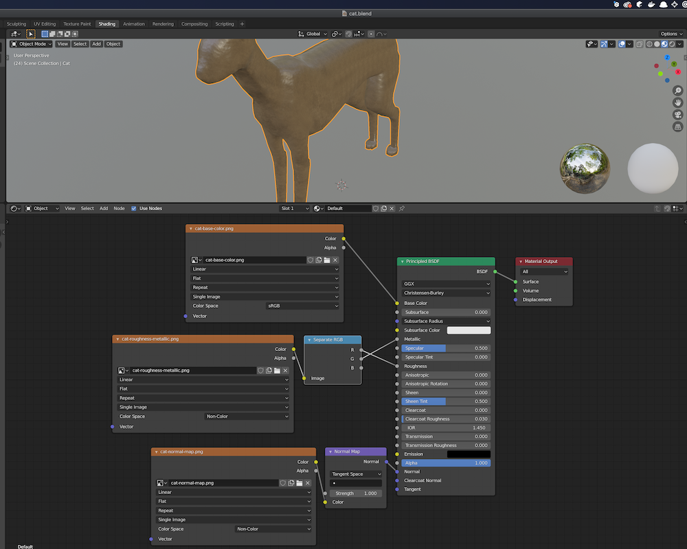

# Materials

`landon` can export data from [Blender's Principled BSDF shader node][principled-bsdf].

In the Rust API they're available through [BlenderMesh#method.materials][materials-rust-api].

Currently the base color, metallic, roughness and normal map inputs are exported.

> In general, if landon does not export something that you need please [open an issue][issues].

We support both uniform/scalar values and texture values for all inputs, with the exception of normal
maps where no use cases for a scalar value come to mind.

|         | Base Color | Metallic      | Roughness | Normal Map |
| ---     | ---        | ---           | ---       | ---        |
| Uniform | ✓          | ✓             | ✓         | ☓          |
| Texture | ✓          | ✓\*           | ✓\*       | ✓\*\*      |

_* - metallic and roughness texture inputs must come through a `Separate RGB` node._

_** - normal map textures must be inputted through a `Normal Map` Blender shader node._

Texture and scalar inputs can be mixed and matched.

For example, it's totally fine for your base color to be a uniform value and your metallic to come from
a texture.

## Texture Inputs

Here's an example of how to input a texture into each supported input field.

Note that this screenshot reads metallic and roughness from the same texture, but you can also read them
from separate textures by using two `Separate RGB` nodes instead of one.

## Scalar Material Inputs

Here's an example of how to input uniform values into the supported input fields.
Simply set your desired values in Blender's `Principled BSDF` shader node and they'll be exported.

[materials-rust-api]: https://docs.rs/blender-mesh/latest/blender_mesh/struct.BlenderMesh.html#method.materials
[issues]: https://github.com/chinedufn/landon/issues
[principled-bsdf]: https://docs.blender.org/manual/en/latest/render/shader_nodes/shader/principled.html
